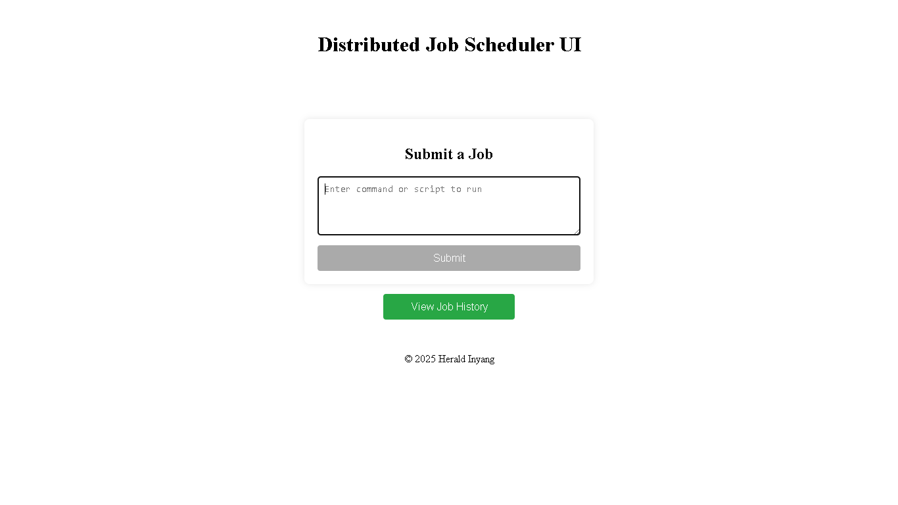
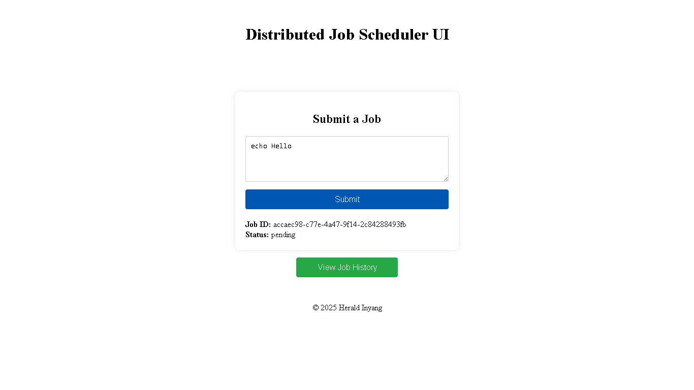
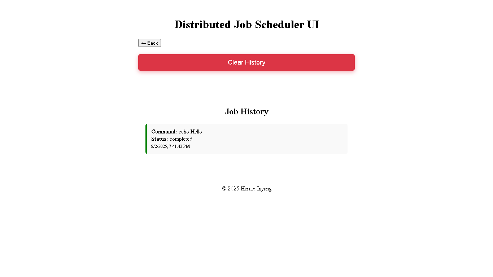

# Distributed Task Runner 

<!-- Centered badges -->
<p align="center">
  <a href="https://golang.org/dl/"></a>
  <a href="https://nodejs.org/"></a>
  <a href="https://raw.githubusercontent.com/HERALDEXX/distributed-task-runner/refs/heads/main/LICENSE"></a>
</p>

A lightweight Distributed Task Runner with a Go backend and React frontend.  
Submit shell commands or scripts as tasks (jobs), execute them asynchronously, and track their status and output via a modern web UI.

---

## 📚 Table of Contents

- [🚀 Quick Start](#quick-start)
- [Features](#features)
- [Project Structure](#project-structure)
- [Prerequisites](#prerequisites)
  - [Tech Stack](#tech-stack)
- [Backend API](#backend-api)
- [Frontend Usage](#frontend-usage)
- [Notes](#notes)
- [Screenshots](#screenshots)
- [Contributing](#contributing)
- [Future Potential Improvements](#future-potential-improvements)
- [License](https://raw.githubusercontent.com/HERALDEXX/distributed-task-runner/refs/heads/main/LICENSE)

---

## Quick Start

### Prerequisite: Install Go

If you don't have Go installed, download and install it from the official website:

[https://go.dev/dl/](https://go.dev/dl/)

---

### Backend (Cross-platform)

```bash
cd backend
```

#### On Windows (PowerShell or Command Prompt):

Run the scheduler using the batch file (this will build and run the backend):

```cmd
./dev.bat
```

> **Note:** The first time you run the backend, Windows may show a firewall prompt. This is normal—allow access so the server can listen on port 8080.

#### On macOS/Linux:

```bash
go run .
```

> **Note:** On macOS/Linux, you typically will NOT see a firewall prompt. If you do, allow access so the server can listen on port 8080.

Server runs on [http://localhost:8080](http://localhost:8080)

### Frontend (Cross-platform)

```bash
cd frontend
```

```bash
npm install
```

```bash
npm run dev
```

Opens on [http://localhost:5173](http://localhost:5173)

---

## Features

- 🧠 Asynchronous task execution via worker pool
- 💾 Persistent storage with [`jobs.json`](backend/jobs.json)
- 🔁 Retry mechanism for failed tasks (up to 3 attempts)
- 🧪 Track status: `pending`, `running`, `completed`, `failed`
- 🧩 RESTful API in Go
- 🎨 React + TypeScript UI for submitting and monitoring tasks
- 🧹 Clear history functionality
- 🔓 CORS support for frontend-backend integration

---

## Project Structure

```
distributed-task-runner/
├── backend/
│   ├── main.go
│   ├── handlers.go
│   ├── jobs.go
│   └── ...
├── frontend/
│   ├── src/
│   │   ├── App.tsx
│   │   ├── JobSubmitter.tsx
│   │   ├── JobList.tsx
│   │   └── ...
│   ├── vite.config.ts
│   └── ...
├── jobs.json  # stores job data
└── README.md
```

---

## Prerequisites

### Tech Stack

| Technology | Version/Requirement |
| ---------- | ------------------- |
| Go         | 1.20+               |
| Node.js    | 16+                 |
| npm/yarn   | Any                 |

---

## Backend API

### Endpoints

- `POST /jobs` — Enqueue a task `{ "payload": "your-command" }`
- `GET /jobs` — List all tasks
- `GET /jobs/{id}` — Get a specific task
- `DELETE /jobs/clear` — Clear all task history

#### Example: Submit a task

```bash
curl -X POST http://localhost:8080/jobs -H "Content-Type: application/json" -d '{"payload": "echo Hello"}'
```

Response:

```json
{
  "id": "abc123",
  "payload": "echo Hello",
  "status": "pending",
  "attempts": 0,
  "created_at": "2025-08-02T14:32:47Z",
  "updated_at": "2025-08-02T14:32:47Z"
}
```

#### Example: Get All tasks

```bash
curl http://localhost:8080/jobs
```

Response:

```json
[
  {
    "id": "abc123",
    "payload": "echo Hello",
    "status": "completed",
    "attempts": 1,
    "created_at": "2025-08-02T14:32:47Z",
    "updated_at": "2025-08-02T14:33:01Z",
    "output": "Hello\n"
  }
]
```

#### Example: Get task by ID

```bash
curl http://localhost:8080/jobs/<job_id>
```

Response:

```json
{
  "id": "abc123",
  "payload": "echo Hello",
  "status": "completed",
  "attempts": 1,
  "created_at": "2025-08-02T14:32:47Z",
  "updated_at": "2025-08-02T14:33:01Z",
  "output": "Hello\n"
}
```

#### Example: Clear task History

```bash
curl -X DELETE http://localhost:8080/jobs/clear
```

---

## Frontend Usage

- Submit tasks (jobs) and monitor their status in real time.
- View job history, including command, status (color-coded), and timestamps.
- Use **Clear History** to delete all jobs.
- Frontend proxies requests to the backend (see [`vite.config.ts`](frontend/vite.config.ts)).

---

## Notes

- Commands run using `cmd` (on Windows) or `sh` (on Unix).
- Backend retries failed tasks (max 3).
- Data is written to [`jobs.json`](backend/jobs.json) after execution.
- CORS enabled for frontend access.

---

## Screenshots

### 🏠 Homepage (Submit Job)



---

### ✅ Job Successfully Submitted



---

### 📜 Job History Page



---

## Contributing

Contributions are welcome! To contribute:

1. Fork the repo
2. Create a new branch (`git checkout -b feature/your-feature`)
3. Commit your changes
4. Push to your branch
5. Open a Pull Request

---

## Future Potential Improvements

- [ ] Auth (JWT or session-based)
- [ ] SSE/WebSocket for real-time task (job) updates
- [ ] Dockerize backend and frontend
- [ ] Pagination for large task lists
- [ ] Task expiration / TTL
- [ ] Worker monitoring UI

---

<div align="center">
    <p>
        <strong style="font-weight: bold;">MIT Licensed • © 2025 Herald Inyang •</strong> 
        <a href="https://github.com/HERALDEXX" target="_blank">
            
        </a>
    </p>
    <p>
        <a href="https://raw.githubusercontent.com/HERALDEXX/distributed-task-runner/refs/heads/main/LICENSE" target="_blank">
            
        </a>
    </p>
</div>

---
